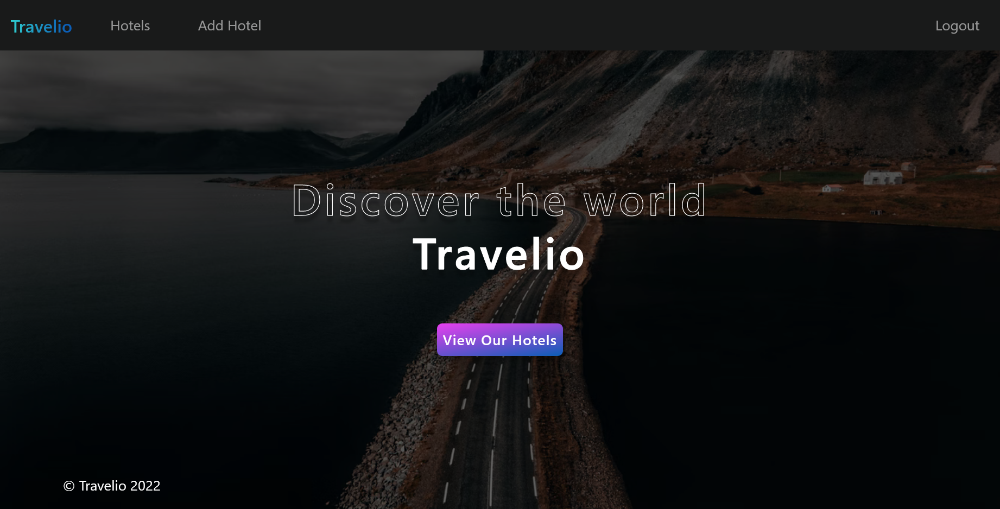
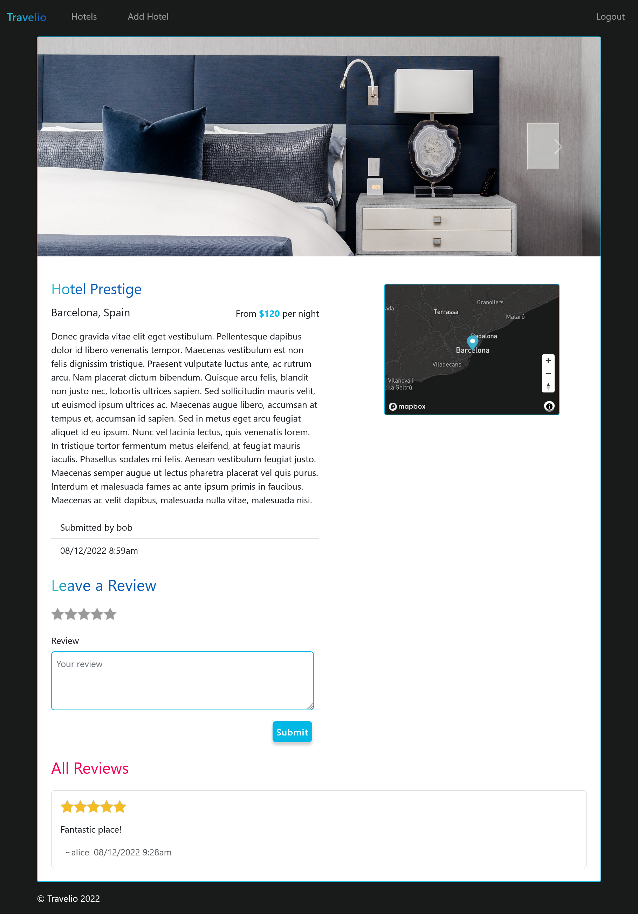
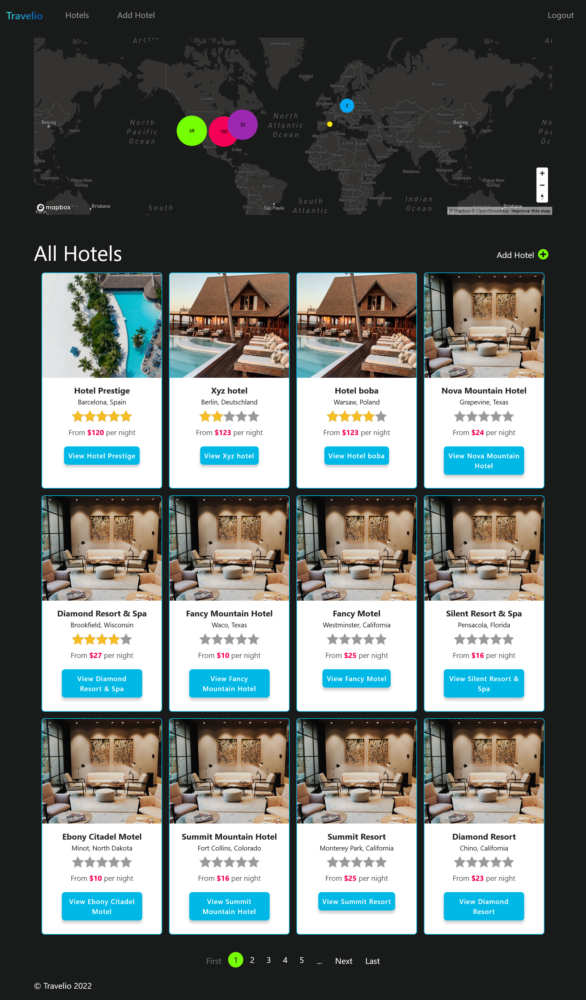

  

# Travelio - worldwide hotel search app with map

Responsive website that collects information about hotels from around the world.  
The application has a login and validation of transmitted data. Registered users can add their own hotels, rate and comment hotels of other users.

The inspiration for creating this website was the course I completed, 'The Web Developer Bootcamp 2022' by Colt Steele.

## ✨ Overview

### 📷 Screenshots

### 🎯 Features

- Form validation
- Notifications
- Comments
- Ratings

### 💎 Pages

- Landing page
- List of hotels
- Registration
- Login
- Add hotel
- Edit hotel

### 🔎 Links

Visit the website at https://travelio-app.fly.dev

### 🚀 Tech stack

- NodeJS
- Express
- MongoDB
- Cloudinary
- Bootstrap 5.2.0
- Passport
- Mapbox

## 🛫 Getting started

### 🔑 Environment Variables

To run this project, you will need to add the following environment variables to your `.env` file
`CLOUDINARY_CLOUD_NAME`
`CLOUDINARY_API_KEY`
`CLOUDINARY_API_SECRET`

`MAPBOX_TOKEN`
`DB_URL`
`SECRET`

### 🏃‍♀️ Run locally

#### Clone the project

`git clone https://github.com/dboinska/travelio`

#### Go to the project directory

`cd travelio`

#### Install dependencies

`npm install`

#### Start the server

`npm start`

#### Additional step: fill the database with random data

`node seeds/index.js`

<small>Icon provided by [freepik](https://www.freepik.com)</small>
